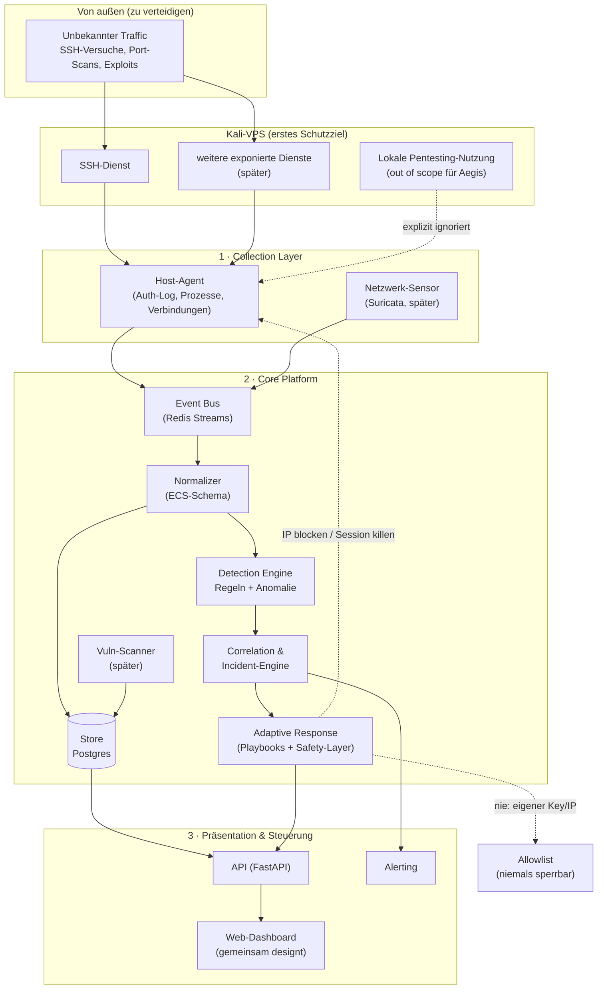

# Architektur — Aegis Defensive Security Platform

Dieses Dokument beschreibt die Zielarchitektur. Es ist ein lebendes Dokument
und wird pro Phase verfeinert. Grundlage sind konkrete Entscheidungen, die
gemeinsam getroffen wurden (siehe Abschnitt 0) — kein abstrakter
Wunschzettel, sondern ein Plan für ein reales Setup.

---

## 0. Reales Setup (Ausgangslage)

- **Entwicklungs- & erstes Schutzziel:** ein eigener **Kali-VPS**. Nichts
  geschäftskritisches läuft dort — idealer Ort zum Bauen und Fehlermachen.
- **Zugang:** SSH mit **Key** (kein Passwort-Login). Der eigene Key/die
  eigene IP kommen auf eine harte Allowlist, die die Response-Engine
  **niemals** sperren darf — Selbst-Aussperren ist das größte Betriebsrisiko.
- **Doppelnutzung des Kali-Servers:** Der Server dient gleichzeitig als
  Pentesting-Werkzeugkasten (nmap, Metasploit, etc.). Aegis überwacht daher
  bewusst nur die **eingehende** Angriffsfläche (was von außen auf den
  Server zukommt), nicht die eigene, lokale Tool-Nutzung. Das vermeidet
  False-Positives durch die eigene Pentesting-Arbeit.
- **Zweiter Server (später, vorsichtiger):** hostet geschäftlich genutzte
  Web-Apps. Wird erst angebunden, wenn sich Aegis auf dem Kali-Server
  bewährt hat — dort gilt von Anfang an ein deutlich konservativerer
  Response-Modus (mehr Freigaben, weniger Automatik).
- **Motivation:** reale Absicherung **und** Lernen beim Selberbauen — beides
  gleichrangig, keines geht auf Kosten des anderen.
- **Zusammenarbeit:** Ein Großteil des Codes wird von Claude geschrieben;
  Entscheidungen an Weichenstellungen werden kurz erklärt und vom
  Projektinhaber freigegeben/korrigiert. Das Dashboard-Design wird
  **gemeinsam** gestaltet, sobald diese Phase ansteht.

---

## 1. Designprinzipien

1. **Modular & entkoppelt** — jede Komponente ist eigenständig ersetz- und
   deploybar. Kommunikation über ein gemeinsames Event-Schema.
2. **Bewährtes integrieren statt neu erfinden** — für IDS, Scanning und
   Regel-Erkennung nutzen wir etablierte Open-Source-Werkzeuge (Suricata,
   nmap, nuclei, Sigma). Unser Mehrwert ist die **einheitliche
   Orchestrierung, Korrelation und adaptive Reaktion**.
3. **Eingehend vor ausgehend.** Wir verteidigen die Angriffsfläche des
   Servers gegen Dritte — wir überwachen nicht die eigene, legitime
   Nutzung des Servers durch dich.
4. **Defensiv, mit Mensch im Kontrollkreis** — automatische Gegenmaßnahmen
   laufen zuerst im Dry-Run; kritische Aktionen brauchen Freigabe.
5. **Sicher by default** — least privilege, alle Aktionen auditierbar,
   Rollback für jede Gegenmaßnahme, eigener Zugang ist unantastbar.
6. **Realistisch bleiben.** Vollautomatische Ursachenforschung + Patch einer
   unbekannten Lücke ist kein MVP-Ziel, sondern ein optionales Stretch-Goal
   für ganz am Ende (siehe Abschnitt 8).
7. **Wächst mit dem Bedarf** — startet als eine Docker-Compose-Instanz auf
   dem Kali-Server, wächst später auf weitere Server/Umgebungen.

---

## 2. Gesamtarchitektur (High-Level)



---

## 3. Komponenten im Detail

### 3.1 Collection Layer (Collectors / Agents)

Sammelt Rohdaten an der Quelle und schickt normalisierte Events an den Bus.
Startfokus: **ein** Host-Agent auf dem Kali-Server, der gezielt eingehende
Aktivität beobachtet.

- **Host-Agent** (Python)
  - Auth-Log-Tailing (`/var/log/auth.log`, journald) — SSH-Login-Versuche,
    erfolgreich/fehlgeschlagen, neue Nutzer, `sudo`-Nutzung
  - Netzwerkverbindungs-Monitoring (psutil) — **eingehende** Verbindungen
    auf exponierte Ports; ausgehende, vom Nutzer selbst initiierte
    Verbindungen werden nicht als Bedrohung gewertet
  - Neue-Prozess-Erkennung nach verdächtigem Login (Hinweis auf
    Post-Exploitation, nicht auf reguläre Pentesting-Arbeit)
  - Führt lokale Response-Aktionen aus (IP blocken, Session killen) —
    **niemals** gegen die Allowlist
- **Netzwerk-Sensor** (spätere Phase) — Wrapper um **Suricata** für
  Signatur-basierte Netzwerk-Erkennung, EVE-JSON-Output.

> **Prinzip:** Collectors sind „dumm" — sie sammeln und normalisieren, treffen
> aber keine Erkennungsentscheidungen. Das hält sie leichtgewichtig.

### 3.2 Event Bus & Normalizer

- **Event Bus:** Redis Streams zum Start (einfach, robust, persistent).
- **Normalizer:** überführt alle Events in ein **gemeinsames Schema**,
  angelehnt an **ECS (Elastic Common Schema)** — Felder wie `@timestamp`,
  `host.name`, `source.ip`, `event.category`, `event.severity`,
  `event.direction` (inbound/outbound/local — zentral für unseren
  Scope-Filter).

### 3.3 Storage

- **Start:** PostgreSQL — deckt Events, Assets, Incidents und Audit-Log ab.
- **Retention-Policies** pro Event-Kategorie konfigurierbar.
- Skalierung (OpenSearch etc.) erst, wenn tatsächlich nötig — kein
  Over-Engineering für ein Ein-Server-MVP.

### 3.4 Detection Engine

Zwei Erkennungsarten zum Start, dritte folgt:

1. **Regelbasiert** — einfache, klare Regeln zuerst (z. B. „N
   fehlgeschlagene SSH-Logins von derselben IP in X Minuten"), später
   erweiterbar auf **Sigma-Regeln** (offener Standard, großes
   Community-Repository) für mehr Deckungsbreite.
2. **Verhaltensbasiert (Post-Compromise)** — Signale, die auf einen
   erfolgreichen Einbruch *nach* einem Login hindeuten: neuer Prozess mit
   ungewöhnlichem Elternprozess, neue Nutzerkonten, Rechte-Eskalation,
   unerwartete ausgehende Verbindung direkt nach fremdem Login.
3. **Anomalie-/statistisch** (später) — Baselines für normales Verhalten,
   ML erst wenn genug echte Daten gesammelt wurden.

Jede Erkennung erzeugt einen **Alert** mit Severity und Kontext.

### 3.5 Correlation & Incident-Engine

- Fasst zusammenhängende Alerts zu **Incidents** zusammen (gleiche Quelle,
  Zeitfenster, Angriffskette: z. B. Brute-Force → erfolgreicher Login →
  verdächtiger Prozess = ein Incident, nicht drei einzelne Alerts).
- Verwaltet Incident-Lebenszyklus: `new → triaged → contained → resolved`.
- Baut die **Verdachtsspur** auf: welche Events in welcher Reihenfolge
  führten zum Incident (Basis für „wie kam der Angreifer rein").

### 3.6 Adaptive Response Engine — das Herzstück

Reagiert auf Incidents mit **Playbooks** (deklarative YAML-Definitionen):
`Trigger → Aktionen → Safety-Gate`.

**MVP-Aktionen (defensiv, in Reihenfolge des Aufbaus):**
1. Verdächtige IP temporär **blocken** (nftables) — dein Brute-Force-Fall.
2. Bei Verdacht auf erfolgreiche Kompromittierung: Session/Prozess
   **beenden**, betroffenes Konto sperren.
3. **Verdachtsspur ausgeben** (welcher Login, welcher Prozess, welche
   Lücke wahrscheinlich) — der Mensch übernimmt die eigentliche Analyse
   und den Fix.

**Safety-Mechanismen (nicht verhandelbar):**
- **Allowlist zuerst.** Eigener SSH-Key/eigene IP sind kategorisch von
  jeder Blockier-Aktion ausgenommen — hart codiert, nicht nur
  Konfiguration.
- **Dry-Run-Modus** als Default für jede neue Playbook-Aktion, bevor sie
  scharf geschaltet wird.
- **Approval-Gates, nach Schweregrad gestaffelt** — nicht alles braucht
  dieselbe Reibung: kritische Aktionen brauchen eine bewusste
  Halten-zum-Bestätigen-Geste (Long-Press), hohe eine Zwei-Klick-Bestätigung,
  mittlere/niedrige können direkt freigegeben werden. Reibung proportional
  zum Risiko, nicht pauschal.
- **Rollback/TTL** — jede Blockade läuft automatisch ab, sofern nicht
  bestätigt.
- **Fail-Active vs. Fail-Closed pro Playbook**, nicht global einheitlich:
  harmlose Maßnahmen (z. B. Rate-Limit) dürfen bei Ablauf der Freigabefrist
  automatisch ausgeführt werden (fail-active); folgenreiche Maßnahmen
  (IP-Block, Session-Kill) verwerfen bei Ablauf ohne Bestätigung
  (fail-closed). Diese Einstufung ist Teil der Playbook-Definition.
- **Globaler Not-Aus-Schalter** (SCHARF/DRY-RUN) für die gesamte
  Response-Engine, jederzeit sichtbar und mit einem Klick erreichbar.
- **Vollständiges Audit-Log** jeder ausgelösten Aktion, inkl. Unterscheidung
  automatisch (⚙) vs. menschlich (☺) ausgelöst.

> ⚠️ Diese Engine bauen wir bewusst **zuletzt** und beginnen im reinen
> Beobachtungsmodus. Fehlkonfigurierte Automatik kann mehr Schaden anrichten
> als der Angriff selbst — besonders wichtig, sobald der zweite
> (geschäftlich genutzte) Server angebunden wird.

### 3.7 API & Dashboard

- **API:** FastAPI (Python) — REST + WebSocket für Live-Updates.
- **Dashboard:** Ein erstes, gemeinsam erarbeitetes Referenz-Design liegt
  bereits vor: [`dashboard/design/Aegis_Dashboard.html`](../dashboard/design/Aegis_Dashboard.html).
  Es dient als visuelle/UX-Referenz für die spätere Implementierung
  (Frontend-Stack-Entscheidung und Datenanbindung folgen erst, wenn Phase 1
  ansteht — das Design ist konzeptionell bereits vorgezogen).
  Screens/Navigation:
  - **Live-Feed** — Echtzeit-Strom eingehender Events, mit Schweregrad-Filter
  - **Incidents** — Liste + Detailansicht mit Kill-Chain-Stages (RECON →
    ZUGRIFF → AUSFÜHRUNG → PERSISTENZ → EXFILTRATION) und Verdachtsspur
    (zeitlicher Trace der Einzel-Events, die zum Incident führten), inkl.
    Konfidenz-Score
  - **Freigaben (Approval Queue)** — offene Response-Aktionen, gestaffelte
    Bestätigungs-Reibung nach Schweregrad (siehe 3.6), mit Begründung,
    auszuführendem Befehl, Impact-/Risiko-Einschätzung und Dauer-Auswahl
  - **Response** — bereits ausgelöste Aktionen mit Live-Fortschritt je
    Schritt, Möglichkeit zum nachträglichen Zurücknehmen (Undo/Revert)
  - **Playbooks** — Verwaltung inkl. Scharf/Dry-Run-Umschalter pro Playbook
  - **Assets** — pro überwachtem Host (z. B. Kali-Lab vs. Geschäftsserver)
    die exponierten Dienste, deren Erreichbarkeit und bekannte Schwachstellen
  - **Audit-Log** — vollständige Aktionshistorie, automatisch vs. menschlich
    gekennzeichnet
  - Global: Theme-Umschalter (Dark/Light, Dark als Standard), Dichte-Einstellung
    (kompakt/komfortabel), globaler SCHARF/DRY-RUN-Schalter
- **Frontend-Stack:** Für die produktive Implementierung noch offen —
  Entscheidung fällt, wenn das Design in eine echte, datengebundene
  Anwendung überführt wird.

### 3.8 Alerting & Benachrichtigung

- Kanäle: E-Mail, Webhook — Start mit einem einfachen Kanal, Ausbau je
  nach Bedarf.
- Eskalationsstufen nach Severity.

### 3.9 Vulnerability Scanner (spätere Phase)

Orchestriert bewährte Scanner (nmap, nuclei), sobald der Kern
(Monitoring → Detection → Response) steht. Details folgen zu Phase 3 der
Roadmap.

---

## 4. Tech-Stack

| Bereich | Wahl | Begründung |
|---------|------|------------|
| Sprache Core | **Python 3.12** | Reichste Security-Bibliotheken, passt zu deinen Kenntnissen |
| API | **FastAPI** | Async, typisiert, OpenAPI out-of-the-box |
| Event Bus | **Redis Streams** | Einfach, robust, genug für ein Ein-Server-MVP |
| Datenbank | **PostgreSQL** | Solide für Events, Assets, Incidents |
| IDS (später) | **Suricata** | Industriestandard, EVE-JSON-Output |
| Detection-Regeln | **eigene Regeln zuerst, Sigma später** | Klarheit vor Vollständigkeit |
| Scanner (später) | **nmap, nuclei** | Bewährt, breit abgedeckt |
| Frontend | **gemeinsam zu entscheiden** | Siehe Dashboard-Phase |
| Deployment | **Docker Compose** | Ein-Kommando-Setup auf dem Kali-VPS |
| CI | **GitHub Actions** | Lint, Tests, Security-Scan der eigenen Codebasis |

---

## 5. Projektstruktur

```
aegis/
├── docs/                    # Architektur, Roadmap
├── core/
│   ├── ingestion/           # Event Bus + Normalizer
│   ├── detection/           # Regel-Engine (später + Sigma)
│   ├── correlation/         # Incident-Engine
│   ├── response/            # Playbooks + Safety-Layer (Allowlist!)
│   └── storage/             # DB-Modelle, Migrationen
├── collectors/
│   └── host_agent/          # Auth-Log, Prozesse, Verbindungen (Kali-VPS)
├── api/                     # FastAPI-App
├── dashboard/                # Web-UI (gemeinsam designt)
├── playbooks/               # YAML-Response-Playbooks
├── deploy/                  # docker-compose, Beispiel-Configs
└── tests/
```

---

## 6. Sicherheit, Recht & Ethik

- **Nur eigene/autorisierte Systeme.** Aegis läuft ausschließlich auf dem
  eigenen Kali-VPS (und später dem zweiten eigenen Server). Kein Scanning
  oder Response gegen fremde Systeme.
- **Kein Hack-Back.** Gegenmaßnahmen sind ausschließlich defensiv am
  eigenen Perimeter (blockieren/isolieren/drosseln). Keine aktiven
  Aktionen gegen Angreifer-Infrastruktur.
- **Eigener Zugang ist unantastbar.** SSH-Key/eigene IP sind kategorisch
  von jeder automatischen Blockade ausgenommen.
- **Least Privilege.** Jede Komponente bekommt nur die minimal nötigen
  Rechte; Response-Aktionen laufen über eng umrissene, auditierte
  Schnittstellen.
- **Fail-safe statt fail-open** bei der Response-Engine: im Zweifel nicht
  automatisch handeln, sondern alarmieren.
- **Zweiter Server (geschäftlich genutzt):** hier gilt beim Rollout ein
  deutlich konservativerer Modus — mehr Freigaben, weniger Automatik, bis
  Vertrauen in die Erkennung aufgebaut ist.

---

## 7. Offene Punkte für später

- **Dashboard-Design** — gemeinsam, sobald Phase 1 ansteht.
- **Projektname** — „Aegis" ist Arbeitstitel, kann noch geändert werden.
- **Rollout auf den zweiten Server** — Zeitpunkt und konkrete Anpassungen
  werden entschieden, sobald der Kern auf dem Kali-Server läuft.

---

## 8. Stretch-Goal (ganz am Ende, nur wenn alles andere sauber läuft)

Vollautomatische Ursachenforschung + Patch-Erstellung für unbekannte
Lücken (echte „Zero-Day-Selbstheilung"). Das ist ein offenes
Forschungsproblem, kein realistisches MVP-Ziel. Falls der Kern (Erkennung,
Isolation, Verdachtsspur) einmal zuverlässig läuft, können wir hier
vorsichtig experimentieren (z. B. automatisierte Vorschläge für
Firewall-/Config-Änderungen, die ein Mensch bestätigt) — aber das ist
bewusst kein Teil der Kern-Roadmap.
