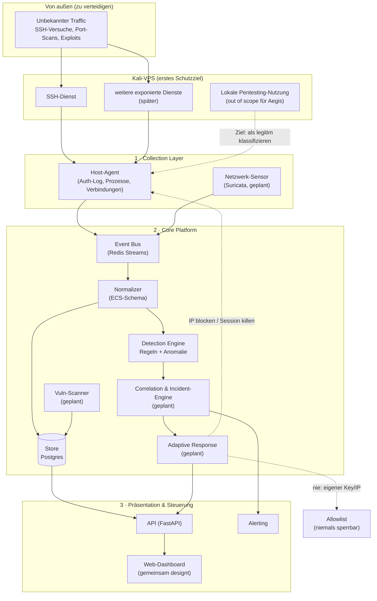

# Architektur — Aegis Defensive Security Platform

Dieses Dokument trennt die heute laufende MVP-Architektur vom späteren
Zielbild. Nicht ausdrücklich als „implementiert" bezeichnete Scanner-,
Korrelations- und Response-Komponenten sind geplant, aber noch nicht vorhanden.

---

## 0. Reales Setup (Ausgangslage)

- **Entwicklungs- & erstes Schutzziel:** ein eigener **Kali-VPS**. Nichts
  geschäftskritisches läuft dort — idealer Ort zum Bauen und Fehlermachen.
- **Zugang:** SSH mit **Key** (kein Passwort-Login). Der eigene Key/die
  eigene IP kommen auf eine harte Allowlist, die die Response-Engine
  **niemals** sperren darf — Selbst-Aussperren ist das größte Betriebsrisiko.
- **Doppelnutzung des Kali-Servers:** Der Server dient gleichzeitig als
  Pentesting-Werkzeugkasten (nmap, Metasploit, etc.). Das Ziel ist daher, nur
  die **eingehende** Angriffsfläche als Bedrohung zu bewerten und eigene,
  lokale Tool-Nutzung als legitim zu klassifizieren. Der aktuelle MVP sammelt
  Prozess-/Socket-Snapshots noch breiter; diese Abgrenzung ist ausstehend.
- **Zweiter Server (später, vorsichtiger):** hostet geschäftlich genutzte
  Web-Apps. Wird erst angebunden, wenn sich Aegis auf dem Kali-Server
  bewährt hat — dort gilt von Anfang an ein deutlich konservativerer
  Response-Modus (mehr Freigaben, weniger Automatik).
- **Motivation:** reale Absicherung **und** Lernen beim Selberbauen — beides
  gleichrangig, keines geht auf Kosten des anderen.
- **Dashboard-Referenz:**
  [`dashboard/design/Aegis_Dashboard.html`](../dashboard/design/Aegis_Dashboard.html)
  ist das verbindliche Zielbild; der laufende MVP nähert sich ihm inkrementell.

---

## 1. Designprinzipien

1. **Modular & entkoppelt** — jede Komponente ist eigenständig ersetz- und
   deploybar. Kommunikation über ein gemeinsames Event-Schema.
2. **Bewährtes integrieren statt neu erfinden** — für IDS, Scanning und
   Regel-Erkennung nutzen wir etablierte Open-Source-Werkzeuge (Suricata,
   nmap, nuclei, Sigma). Unser Mehrwert ist die **einheitliche
   Orchestrierung, Korrelation und adaptive Reaktion**.
3. **Eingehend vor ausgehend.** Wir verteidigen die Angriffsfläche des
   Servers gegen Dritte — wir überwachen nicht die eigene, legitime
   Nutzung des Servers durch dich.
4. **Defensiv, mit Mensch im Kontrollkreis** — automatische Gegenmaßnahmen
   laufen zuerst im Dry-Run; kritische Aktionen brauchen Freigabe.
5. **Sicher by default** — least privilege, alle Aktionen auditierbar,
   Rollback für jede Gegenmaßnahme, eigener Zugang ist unantastbar.
6. **Realistisch bleiben.** Vollautomatische Ursachenforschung + Patch einer
   unbekannten Lücke ist kein MVP-Ziel, sondern ein optionales Stretch-Goal
   für ganz am Ende (siehe Abschnitt 8).
7. **Wächst mit dem Bedarf** — startet als eine Docker-Compose-Instanz auf
   dem Kali-Server, wächst später auf weitere Server/Umgebungen.

---

## 2. Gesamtarchitektur (High-Level)

Das Diagramm zeigt das Zielbild; „später" markierte Knoten gehören noch nicht
zum ausführbaren System. Der aktuelle Datenpfad ist:

`Host-Agent → Redis Stream → Ingestion-Worker → PostgreSQL (Events, Alerts,
Notification-Outbox) → Notification-Worker sowie FastAPI/Jinja-Dashboard`.



---

## 3. Komponenten im Detail

### 3.1 Collection Layer (Collectors / Agents)

Sammelt Rohdaten an der Quelle und schickt normalisierte Events an den Bus.
Startfokus: **ein** Host-Agent auf dem Kali-Server, der gezielt eingehende
Aktivität beobachtet.

- **Heute implementiert:** Datei-Tailing eines konfigurierbaren Auth-Logs,
  Parsen erfolgreicher/fehlgeschlagener Logins, Events für neu beobachtete
  Prozesse und aggregierte Socket-Zähler. Das echte Host-Log-Verzeichnis wird
  read-only eingebunden; Host-PID- und Netzwerk-Namespace liefern die nötige
  Sicht auf Prozesse und Sockets.
- **Noch nicht implementiert:** direktes journald-Lesen, semantische
  Beschränkung der Socket-/Prozess-Snapshots auf ausschließlich eingehende
  Aktivität, loginbezogene Prozessketten, lokale Response-Aktionen und der
  Suricata-Netzwerksensor.

> **Prinzip:** Collectors sind „dumm" — sie sammeln und normalisieren, treffen
> aber keine Erkennungsentscheidungen. Das hält sie leichtgewichtig.

### 3.2 Event Bus & Normalizer

- **Event Bus:** authentifizierte Redis Streams mit AOF-Persistenz. Der
  Ingestion-Consumer bestätigt erst erfolgreich verarbeitete Nachrichten,
  übernimmt verwaiste Pending-Einträge erneut und verschiebt dauerhaft
  fehlerhafte Nachrichten nach begrenzten Versuchen in einen größenbegrenzten
  Dead-Letter-Stream.
- **Normalizer:** überführt alle Events in ein **gemeinsames Schema**,
  angelehnt an **ECS (Elastic Common Schema)** — Felder wie `@timestamp`,
  `host.name`, `source.ip`, `event.category` und `event.severity`.
  Eine explizite Richtungsklassifikation (`inbound/outbound/local`) ist als
  spätere Schema-Anreicherung geplant und heute noch kein Event-Feld.

### 3.3 Storage

- **Start:** PostgreSQL. Aktiv genutzt werden Events, Alerts und die
  Notification-Outbox. Modelle für Assets, Incidents und Audit-Log existieren
  als Grundlage, besitzen aber noch keine vollständigen Workflows.
- **Implementiert:** globale, tagebasierte Event-Retention in begrenzten
  Batches durch einen eigenen Maintenance-Worker.
- **Geplant:** unterschiedliche Retention-Policies pro Event-Kategorie.
- Skalierung (OpenSearch etc.) erst, wenn tatsächlich nötig — kein
  Over-Engineering für ein Ein-Server-MVP.

### 3.4 Detection Engine

Drei leichtgewichtige Erkennungsarten sind im MVP implementiert:

1. **Schwellwertregel** — fehlgeschlagene SSH-Logins derselben Quell-IP auf
   demselben Zielhost innerhalb eines Zeitfensters, mit Cooldown.
2. **Keyword-Regeln** — kuratierte YAML-Muster, aktuell neues Admin-/Sudo-
   Konto und Reverse-Shell-Indikatoren, je Host dedupliziert.
3. **Statistisch** — Z-Score auf der Prozess-Erstellungsrate pro Host mit
   Mindestmenge, Baseline-Fenstern und Cooldown.

Vollständige Sigma-Unterstützung, Prozessketten-Korrelation und ML sind
weiterhin geplant.

Jede Erkennung erzeugt einen **Alert** mit Severity und Kontext.

### 3.5 Correlation & Incident-Engine

**Status: geplant.** Die vorhandenen Alert-Datensätze werden noch nicht zu
Incidents oder Angriffsketten zusammengefasst.

- Fasst zusammenhängende Alerts zu **Incidents** zusammen (gleiche Quelle,
  Zeitfenster, Angriffskette: z. B. Brute-Force → erfolgreicher Login →
  verdächtiger Prozess = ein Incident, nicht drei einzelne Alerts).
- Verwaltet Incident-Lebenszyklus: `new → triaged → contained → resolved`.
- Baut die **Verdachtsspur** auf: welche Events in welcher Reihenfolge
  führten zum Incident (Basis für „wie kam der Angreifer rein").

### 3.6 Adaptive Response Engine — das Herzstück

**Status: geplant.** Es existiert noch keine ausführende Response-Engine.

Reagiert auf Incidents mit **Playbooks** (deklarative YAML-Definitionen):
`Trigger → Aktionen → Safety-Gate`.

**MVP-Aktionen (defensiv, in Reihenfolge des Aufbaus):**
1. Verdächtige IP temporär **blocken** (nftables) — dein Brute-Force-Fall.
2. Bei Verdacht auf erfolgreiche Kompromittierung: Session/Prozess
   **beenden**, betroffenes Konto sperren.
3. **Verdachtsspur ausgeben** (welcher Login, welcher Prozess, welche
   Lücke wahrscheinlich) — der Mensch übernimmt die eigentliche Analyse
   und den Fix.

**Safety-Mechanismen (nicht verhandelbar):**
- **Allowlist zuerst.** Eigener SSH-Key/eigene IP sind kategorisch von
  jeder Blockier-Aktion ausgenommen — hart codiert, nicht nur
  Konfiguration.
- **Dry-Run-Modus** als Default für jede neue Playbook-Aktion, bevor sie
  scharf geschaltet wird.
- **Approval-Gates, nach Schweregrad gestaffelt** — nicht alles braucht
  dieselbe Reibung: kritische Aktionen brauchen eine bewusste
  Halten-zum-Bestätigen-Geste (Long-Press), hohe eine Zwei-Klick-Bestätigung,
  mittlere/niedrige können direkt freigegeben werden. Reibung proportional
  zum Risiko, nicht pauschal.
- **Rollback/TTL** — jede Blockade läuft automatisch ab, sofern nicht
  bestätigt.
- **Fail-Active vs. Fail-Closed pro Playbook**, nicht global einheitlich:
  harmlose Maßnahmen (z. B. Rate-Limit) dürfen bei Ablauf der Freigabefrist
  automatisch ausgeführt werden (fail-active); folgenreiche Maßnahmen
  (IP-Block, Session-Kill) verwerfen bei Ablauf ohne Bestätigung
  (fail-closed). Diese Einstufung ist Teil der Playbook-Definition.
- **Globaler Not-Aus-Schalter** (SCHARF/DRY-RUN) für die gesamte
  Response-Engine, jederzeit sichtbar und mit einem Klick erreichbar.
- **Vollständiges Audit-Log** jeder ausgelösten Aktion, inkl. Unterscheidung
  automatisch (⚙) vs. menschlich (☺) ausgelöst.

> ⚠️ Diese Engine bauen wir bewusst **zuletzt** und beginnen im reinen
> Beobachtungsmodus. Fehlkonfigurierte Automatik kann mehr Schaden anrichten
> als der Angriff selbst — besonders wichtig, sobald der zweite
> (geschäftlich genutzte) Server angebunden wird.

### 3.7 API & Dashboard

- **API:** FastAPI (Python) mit REST-/HTML-Endpunkten. Alle fachlichen Routen
  sind per HTTP Basic geschützt; nur `/health` bleibt für Container-Probes
  offen. Der Browser aktualisiert Events alle drei und Alerts alle fünf
  Sekunden per Fetch-Polling. WebSockets sind nicht implementiert.
- **Dashboard:** Das verbindliche Referenz-Design liegt
  bereits vor: [`dashboard/design/Aegis_Dashboard.html`](../dashboard/design/Aegis_Dashboard.html).
  Die laufende Jinja/CSS/JavaScript-Oberfläche setzt davon derzeit den
  Event-/Alert-MVP um. Die folgenden weiteren Screens bleiben Zielumfang des
  Referenzdesigns:
  Screens/Navigation:
  - **Live-Feed** — laufend aktualisierte Events mit Schweregrad-Filter
  - **Incidents** — Liste + Detailansicht mit Kill-Chain-Stages (RECON →
    ZUGRIFF → AUSFÜHRUNG → PERSISTENZ → EXFILTRATION) und Verdachtsspur
    (zeitlicher Trace der Einzel-Events, die zum Incident führten), inkl.
    Konfidenz-Score
  - **Freigaben (Approval Queue)** — offene Response-Aktionen, gestaffelte
    Bestätigungs-Reibung nach Schweregrad (siehe 3.6), mit Begründung,
    auszuführendem Befehl, Impact-/Risiko-Einschätzung und Dauer-Auswahl
  - **Response** — bereits ausgelöste Aktionen mit Live-Fortschritt je
    Schritt, Möglichkeit zum nachträglichen Zurücknehmen (Undo/Revert)
  - **Playbooks** — Verwaltung inkl. Scharf/Dry-Run-Umschalter pro Playbook
  - **Assets** — pro überwachtem Host (z. B. Kali-Lab vs. Geschäftsserver)
    die exponierten Dienste, deren Erreichbarkeit und bekannte Schwachstellen
  - **Audit-Log** — vollständige Aktionshistorie, automatisch vs. menschlich
    gekennzeichnet
  - Global: Theme-Umschalter (Dark/Light, Dark als Standard), Dichte-Einstellung
    (kompakt/komfortabel), globaler SCHARF/DRY-RUN-Schalter
- **Frontend-Stack:** serverseitiges Jinja mit lokalem CSS und JavaScript. Es
  werden keine CDN-Skripte zur Laufzeit benötigt.

### 3.8 Alerting & Benachrichtigung

- Implementierte Kanäle: E-Mail und Webhook, aktivierbar über Konfiguration.
- Ingestion legt Zustellungen atomar mit den zugehörigen Datenbankänderungen in
  einer Outbox ab. Ein eigener Worker liefert sie mit begrenztem exponentiellem
  Retry aus; endgültige Fehlschläge bleiben nachvollziehbar gespeichert.
- Ein Severity-Schwellwert steuert direkte Event-Benachrichtigungen; Alerts
  werden ebenfalls vorgemerkt.

### 3.9 Vulnerability Scanner (spätere Phase)

Orchestriert bewährte Scanner (nmap, nuclei), sobald der Kern
(Monitoring → Detection → Response) steht. Details folgen zu Phase 3 der
Roadmap.

---

## 4. Tech-Stack

| Bereich | Wahl | Begründung |
|---------|------|------------|
| Sprache Core | **Python 3.12** | Reichste Security-Bibliotheken, passt zu deinen Kenntnissen |
| API | **FastAPI** | Async, typisiert, OpenAPI out-of-the-box |
| Event Bus | **Redis Streams** | Einfach, robust, genug für ein Ein-Server-MVP |
| Datenbank | **PostgreSQL** | Solide für Events, Assets, Incidents |
| IDS (später) | **Suricata** | Industriestandard, EVE-JSON-Output |
| Detection-Regeln | **eigene Regeln zuerst, Sigma später** | Klarheit vor Vollständigkeit |
| Scanner (später) | **nmap, nuclei** | Bewährt, breit abgedeckt |
| Frontend | **Jinja + lokales CSS/JavaScript** | Kleiner, selbst gehosteter Polling-MVP; Referenzdesign bleibt verbindlich |
| Deployment | **Docker Compose** | Ein-Kommando-Setup auf dem Kali-VPS |
| CI | **GitHub Actions** | Lint, Tests, Security-Scan der eigenen Codebasis |

---

## 5. Projektstruktur

```
aegis/
├── docs/                    # Architektur, Roadmap
├── aeris/                   # installierbare Betriebs-CLI
├── core/
│   ├── ingestion/           # Event Bus + Normalizer
│   ├── detection/           # Regel-Engine (später + Sigma)
│   ├── correlation/         # Incident-Engine
│   ├── response/            # Playbooks + Safety-Layer (Allowlist!)
│   ├── storage/             # DB-Modelle, Migrationen
│   ├── notification_worker.py # persistente Benachrichtigungszustellung
│   └── maintenance.py       # Event-Retention
├── collectors/
│   └── host_agent/          # Auth-Log, Prozesse, Verbindungen (Kali-VPS)
├── api/                     # FastAPI-App
├── dashboard/                # Web-UI (gemeinsam designt)
├── playbooks/               # YAML-Response-Playbooks
├── deploy/                  # docker-compose, Beispiel-Configs
└── tests/
```

---

## 6. Sicherheit, Recht & Ethik

- **Nur eigene/autorisierte Systeme.** Aegis läuft ausschließlich auf dem
  eigenen Kali-VPS (und später dem zweiten eigenen Server). Kein Scanning
  oder Response gegen fremde Systeme.
- **Kein Hack-Back.** Gegenmaßnahmen sind ausschließlich defensiv am
  eigenen Perimeter (blockieren/isolieren/drosseln). Keine aktiven
  Aktionen gegen Angreifer-Infrastruktur.
- **Eigener Zugang ist unantastbar.** SSH-Key/eigene IP sind kategorisch
  von jeder automatischen Blockade ausgenommen.
- **Least Privilege.** Jede Komponente bekommt nur die minimal nötigen
  Rechte; Response-Aktionen laufen über eng umrissene, auditierte
  Schnittstellen.
- **Fail-safe statt fail-open** bei der Response-Engine: im Zweifel nicht
  automatisch handeln, sondern alarmieren.
- **Zweiter Server (geschäftlich genutzt):** hier gilt beim Rollout ein
  deutlich konservativerer Modus — mehr Freigaben, weniger Automatik, bis
  Vertrauen in die Erkennung aufgebaut ist.
- **Deployment-Baseline:** API, PostgreSQL und Redis binden standardmäßig nur
  an Loopback; Datenbank-, Redis- und API-Secrets sind Pflichtwerte. Redis ist
  authentifiziert. App und Worker laufen non-root mit read-only Root-Dateisystem,
  ohne Linux-Capabilities und mit `no-new-privileges`. Nur der Host-Agent läuft
  wegen `/proc` als Root, ohne `privileged` und mit zwei eng begrenzten
  Lesefähigkeiten. Remote-Zugriff erfolgt über SSH-Tunnel oder TLS-Reverse-
  Proxy; siehe [`deployment.md`](deployment.md).

---

## 7. Offene Punkte für später

- **Projektname** — „Aegis" ist Arbeitstitel, kann noch geändert werden.
- **Dashboard-Ausbau** — das verbindliche Referenzdesign über den aktuellen
  Event-/Alert-MVP hinaus umsetzen.
- **Feingranulare Rollen/Rechte** — aktuell existiert ein einzelner
  administrativer HTTP-Basic-Zugang, noch keine Benutzer-/Rollenverwaltung.
- **Kategoriespezifische Retention** — heute gilt ein globales Event-Alter.
- **Rollout auf den zweiten Server** — Zeitpunkt und konkrete Anpassungen
  werden entschieden, sobald der Kern auf dem Kali-Server läuft.

---

## 8. Stretch-Goal (ganz am Ende, nur wenn alles andere sauber läuft)

Vollautomatische Ursachenforschung + Patch-Erstellung für unbekannte
Lücken (echte „Zero-Day-Selbstheilung"). Das ist ein offenes
Forschungsproblem, kein realistisches MVP-Ziel. Falls der Kern (Erkennung,
Isolation, Verdachtsspur) einmal zuverlässig läuft, können wir hier
vorsichtig experimentieren (z. B. automatisierte Vorschläge für
Firewall-/Config-Änderungen, die ein Mensch bestätigt) — aber das ist
bewusst kein Teil der Kern-Roadmap.
