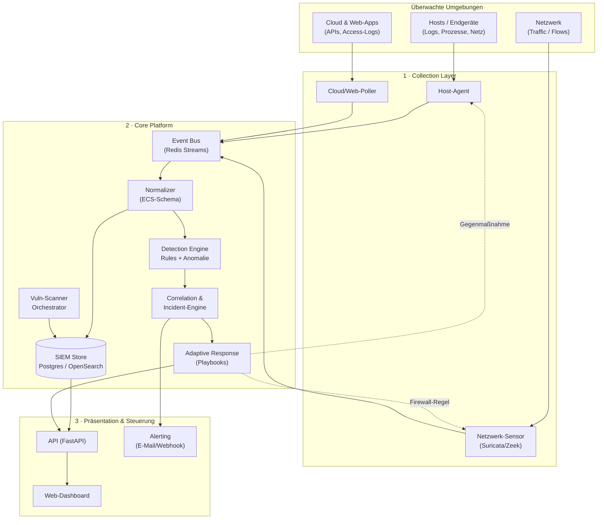

# Architektur — Aegis Defensive Security Platform

Dieses Dokument beschreibt die Zielarchitektur. Es ist ein lebendes Dokument
und wird pro Phase verfeinert.

---

## 1. Designprinzipien

1. **Modular & entkoppelt** — jede Komponente ist eigenständig ersetz- und
   deploybar. Kommunikation über ein gemeinsames Event-Schema.
2. **Bewährtes integrieren statt neu erfinden** — für IDS, Scanning und
   Regel-Erkennung nutzen wir etablierte Open-Source-Werkzeuge (Suricata,
   Zeek, nmap, nuclei, Trivy, Sigma). Unser Mehrwert ist die **einheitliche
   Orchestrierung, Korrelation und adaptive Reaktion**.
3. **Defensiv, mit Mensch im Kontrollkreis** — automatische Gegenmaßnahmen
   laufen zuerst im Dry-Run; kritische Aktionen brauchen Freigabe.
4. **Sicher by default** — least privilege, alle Aktionen auditierbar,
   Rollback für jede Gegenmaßnahme.
5. **Umgebungs-agnostisch** — dasselbe Kernsystem für Heimnetz, einzelnen
   Server, Cloud-Konto oder Firmennetz; Unterschiede stecken in den Collectors.
6. **Skaliert mit dem Bedarf** — startet als eine Docker-Compose-Instanz,
   wächst später zu verteilten Sensoren + zentralem Core.

---

## 2. Gesamtarchitektur (High-Level)



---

## 3. Komponenten im Detail

### 3.1 Collection Layer (Collectors / Agents)

Sammelt Rohdaten an der Quelle und schickt normalisierte Events an den Bus.

- **Host-Agent** (Python, später ggf. Go für schlanke Deployments)
  - Log-Tailing (`/var/log`, journald, Windows Event Log später)
  - Prozess- & Netzwerkverbindungs-Monitoring (psutil)
  - Datei-Integritäts-Checks (FIM) für kritische Pfade
  - Führt lokale Response-Aktionen aus (Prozess killen, Host isolieren)
- **Netzwerk-Sensor** — Wrapper um **Suricata** (Signatur-IDS) und optional
  **Zeek** (Protokoll-/Flow-Analyse). Wir konsumieren deren EVE-JSON-Output.
- **Cloud-/Web-Poller** — holt Access-Logs, Auth-Events und
  Konfigurations-Zustände via API (z. B. Cloud-Audit-Logs, Reverse-Proxy-Logs,
  Web-App-Logs).

> **Prinzip:** Collectors sind „dumm" — sie sammeln und normalisieren, treffen
> aber keine Erkennungsentscheidungen. Das hält sie leichtgewichtig.

### 3.2 Event Bus & Normalizer

- **Event Bus:** Redis Streams zum Start (einfach, robust, persistent).
  Später optional NATS/Kafka bei hohem Volumen.
- **Normalizer:** überführt alle Events in ein **gemeinsames Schema**,
  angelehnt an **ECS (Elastic Common Schema)** — Felder wie `@timestamp`,
  `host.name`, `source.ip`, `event.category`, `event.severity`.
  Ein einheitliches Schema ist die Grundlage für sinnvolle Korrelation.

### 3.3 SIEM / Storage

- **Start:** PostgreSQL (mit TimescaleDB-Erweiterung für Zeitreihen) — deckt
  Events, Assets, Incidents und Audit-Log ab.
- **Skalierung:** OpenSearch/Elasticsearch für Volltext-Suche und große
  Event-Mengen, sobald nötig.
- **Retention-Policies** pro Event-Kategorie konfigurierbar.

### 3.4 Detection Engine

Drei komplementäre Erkennungsarten:

1. **Regelbasiert** — **Sigma-Regeln** (offener Standard für SIEM-Detection).
   Riesiges Community-Repository; wir kompilieren Sigma → interne Abfragen.
2. **Signaturbasiert** — kommt aus dem Netzwerk-Sensor (Suricata-Regeln /
   Emerging Threats).
3. **Anomalie-/Verhaltensbasiert** — statistische Baselines (z. B.
   ungewöhnliche Login-Zeiten, Traffic-Spitzen, neue Prozesse). Start:
   einfache Schwellwert-/Z-Score-Verfahren; später ML (Isolation Forest o. ä.).

Jede Erkennung erzeugt ein **Alert** mit Severity, Kontext und MITRE
ATT&CK-Mapping.

### 3.5 Correlation & Incident-Engine

- Fasst zusammenhängende Alerts zu **Incidents** zusammen (gleiche Quelle,
  Zeitfenster, Angriffskette).
- **Deduplizierung** und **Severity-Scoring** (Basis-Score + Asset-Kritikalität
  + Confidence).
- Verwaltet Incident-Lebenszyklus: `new → triaged → contained → resolved`.
- Löst Alerting und (optional) Response-Playbooks aus.

### 3.6 Vulnerability Scanner (Orchestrator)

Orchestriert bewährte Scanner und normalisiert deren Ergebnisse:

- **nmap** — Host-/Port-/Service-Discovery, Asset-Inventar.
- **nuclei** — templatebasiertes Scannen von Web-Apps/Services auf bekannte CVEs.
- **Trivy** — Container-Images, Dependencies, IaC-Misconfigurations.
- Ergebnisse fließen als „Findings" in den Store, verknüpft mit Assets,
  priorisiert nach CVSS + Erreichbarkeit.
- Geplante Scans (Cron) + Ad-hoc-Scans aus dem Dashboard.

### 3.7 Adaptive Response Engine (SOAR) — das Herzstück

Reagiert auf Incidents mit **Playbooks** (deklarative YAML-Definitionen):
`Trigger (Bedingung) → Aktionen → Safety-Gate`.

**Mögliche Aktionen (defensiv):**
- IP/Range am Host oder zentral **blockieren** (iptables/nftables, Cloud-SG)
- Host **isolieren** (Netzwerk kappen bis auf Management)
- Bösartigen **Prozess beenden**
- Konto **sperren** / Sessions invalidieren / Passwort-Reset erzwingen
- Traffic **drosseln** (Rate-Limit) bei DoS-Verdacht
- **Snapshot/Forensik** sichern vor Eingriff

**Safety-Mechanismen (nicht verhandelbar):**
- **Dry-Run-Modus** als Default — Aktion wird nur geloggt, nicht ausgeführt.
- **Approval-Gates** — kritische Aktionen brauchen menschliche Bestätigung
  (Dashboard/Notification), mit Zeitlimit.
- **Allow-/Deny-Listen** — bestimmte Assets/IPs (z. B. eigenes Gateway,
  Admin-Netz) sind nie automatisch angreifbar → verhindert Selbst-Aussperren.
- **Rollback** — jede Aktion ist reversibel und wird nach TTL automatisch
  zurückgenommen, sofern nicht bestätigt.
- **Rate-Limit & Circuit-Breaker** — verhindert „Automatisierungs-Amoklauf".
- **Vollständiges Audit-Log** jeder ausgelösten Aktion.

> ⚠️ Diese Engine bauen wir bewusst **zuletzt** und beginnen im reinen
> Beobachtungsmodus. Fehlkonfigurierte Automatik kann mehr Schaden anrichten
> als der Angriff selbst.

### 3.8 API & Dashboard

- **API:** FastAPI (Python) — REST + WebSocket für Live-Updates.
- **Dashboard:** Web-UI mit
  - Live-Alert-/Incident-Feed
  - Asset-Inventar & Schwachstellen-Übersicht
  - Scan-Steuerung
  - Response-Playbook-Verwaltung & Approval-Queue
  - Audit-Log & Reports
- **Frontend-Stack:** Start pragmatisch mit **HTMX + Jinja** (schnell, wenig
  Ballast) oder **React + Tailwind**, falls du reichhaltige Interaktivität
  willst. → offene Entscheidung, siehe unten.

### 3.9 Alerting & Benachrichtigung

- Kanäle: E-Mail, Webhook (Slack/Teams/Matrix), später Push.
- Eskalationsstufen nach Severity.

---

## 4. Empfohlener Tech-Stack

| Bereich | Wahl | Begründung |
|---------|------|------------|
| Sprache Core | **Python 3.12** | Reichste Security-Bibliotheken, schnell iterierbar |
| API | **FastAPI** | Async, typisiert, OpenAPI out-of-the-box |
| Event Bus | **Redis Streams** | Einfach, persistent, gut genug bis mittleres Volumen |
| Datenbank | **PostgreSQL (+TimescaleDB)** | Solide für Events, Assets, Incidents |
| Suche (später) | **OpenSearch** | Skalierbare Volltext-/Event-Suche |
| IDS | **Suricata** (+ optional Zeek) | Industriestandard, EVE-JSON-Output |
| Detection-Regeln | **Sigma** | Offener, portabler Erkennungsstandard |
| Scanner | **nmap, nuclei, Trivy** | Bewährt, breit abgedeckt |
| Frontend | **HTMX/Jinja** oder **React/Tailwind** | offen — siehe Entscheidungen |
| Deployment | **Docker Compose** | Ein-Kommando-Setup, reproduzierbar |
| CI | **GitHub Actions** | Lint, Tests, Security-Scan der eigenen Codebasis |

---

## 5. Vorgeschlagene Projektstruktur

```
aegis/
├── docs/                    # Architektur, Roadmap, Betriebshandbuch
├── core/
│   ├── ingestion/           # Event Bus + Normalizer
│   ├── detection/           # Sigma-Engine, Anomalie-Detektoren
│   ├── correlation/         # Incident-Engine
│   ├── response/            # SOAR-Playbooks + Safety-Layer
│   ├── scanner/             # nmap/nuclei/Trivy-Orchestrator
│   └── storage/             # DB-Modelle, Migrationen
├── collectors/
│   ├── host_agent/
│   ├── network_sensor/      # Suricata/Zeek-Wrapper
│   └── cloud_poller/
├── api/                     # FastAPI-App
├── dashboard/               # Web-UI
├── playbooks/               # YAML-Response-Playbooks
├── rules/                   # Sigma-Regeln (eigene + kuratierte)
├── deploy/                  # docker-compose, Beispiel-Configs
└── tests/
```

---

## 6. Sicherheit, Recht & Ethik

- **Nur eigene/autorisierte Systeme.** Scanning und Response auf fremden
  Systemen ohne Erlaubnis ist illegal (in DE u. a. §202a–c StGB). Das System
  enthält einen konfigurierten **Scope** (erlaubte Asset-Bereiche); alles
  außerhalb wird verweigert.
- **Kein Hack-Back.** Gegenmaßnahmen sind ausschließlich defensiv am eigenen
  Perimeter (blockieren/isolieren/drosseln). Keine aktiven Aktionen gegen
  Angreifer-Infrastruktur.
- **Least Privilege.** Jede Komponente bekommt nur die minimal nötigen Rechte;
  Response-Aktionen laufen über eng umrissene, auditierte Schnittstellen.
- **Datenschutz.** Logs können personenbezogene Daten enthalten → Retention,
  Zugriffskontrolle, ggf. Pseudonymisierung; bei Firmeneinsatz DSGVO/
  Betriebsrat beachten.
- **Fail-safe statt fail-open** bei der Response-Engine: im Zweifel nicht
  automatisch handeln, sondern alarmieren.

---

## 7. Offene Entscheidungen (vor Baubeginn zu klären)

1. **Frontend:** HTMX/Jinja (schnell, schlank) vs. React/Tailwind (reicher, mehr Aufwand)?
2. **Erste Zielumgebung** für die MVP-Erprobung: Heimnetz, ein einzelner Server, oder eine Web-App?
3. **Projektname:** „Aegis" behalten oder eigener Name?
4. **Deployment-Ziel:** Läuft der Core lokal (Docker Compose auf einem Rechner/NAS) oder auf einem Server/VPS?
```
